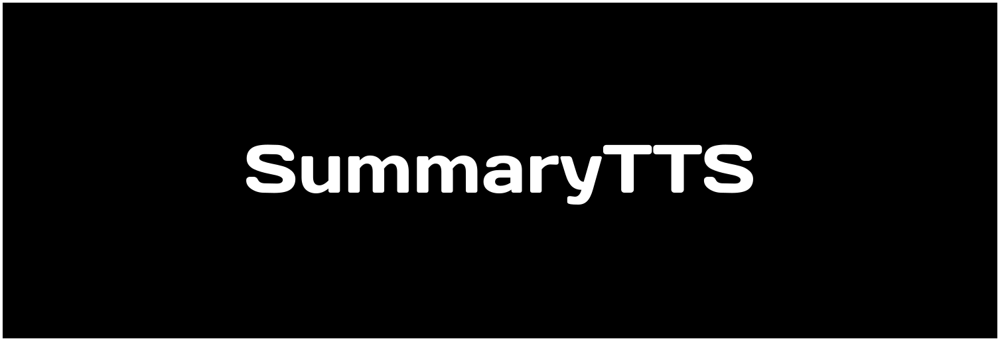

### What is SummaryTTS:

SummaryTTS is an application which allows users to generate a summary of any of their inputs, it can process audio, video, and text content to provide a brief of the input and can read aloud the output!

SummaryTTS was built for time saving and helping the disabled!

##How SummaryTTS works ?
SummaryTTS makes use of OpenAI's Whisper API's to summarize text and uses TTS to read aloud.

## Tools used:

SummaryTTS's frontend was built using a combination of Vite, react, tailwind, html, and css.
It also uses {placeholder for backend} , OpenAI's API, and several other modules.

# Get started

### Use the link:

You can click on the link to try out a version of SummaryTTS.
##Deploy your Own:
You can also deploy your own version of SummaryTTS.
Follow these Steps: Clone this repo! and type in terminal:

    cd frontend
    npm install
    npm run dev

This will deploy a development Frontend for you to work with! Click the link in the terminal response to open the application.

We aren't done yet, we still need to start the backend server!
To do this, simply type in a new terminal window:

    cd backend
    npm install
    npm run dev

Great you've successfully started the server, now you can access the front end!

## Contributors

Susmita Dey
 
Jaisal Srivastava
 
Shubhankar
 
Bharadwaj N
 

